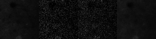

# ca_diffusion
Calcium imaging video synthesis using Latent Flow Matching models.
This repo is currently under construction and mainly serves me for playing around and testing new stuff.

## What Is This Repository About?
Shortly summarized, this codebase transfers the idea of latent diffusion models (LDMs) to the domain of calcium imaging.
The main difference towards normal images/videos is the noise character of the data which is assumed to follow a Poisson-Gaussian distribution
and is thus dependent on the underlying clean structure itself. 
Vanilla application of VAE training as it is done in LDM will fail in the sense that noise will be averaged out through application of reconstruction losses.
This issue can be solved by having a probabilistic decoder as for instance diffusion autoencoders do.
To follow this approach this repository implements a convolution based diffusion autoencoder consisting of a causal convolutional encoder which injects a latent representation to a
causal 3D-UNet based diffusion model as condition to achieve reconstruction of the underlying tissue structure but with different noise.
Convolutional networks are choosen due to the small size of neurons which only require a small receptive field.
In the future I may also experiment with having a further global conditioning which is taken from a different view of the same video to disentangle structure and global noise and intensity parameters.
By training a second diffusion model on the latent representation space generation of new underlying structures can be achieved (currently in progress).
The architectural design of the second stage is build up on diffusion transformers (DiTs).

Future plans involve control of neuron placment through semantic segemenation maps and experimenting with different learning strategies (for instance MAEs, metric learning, ...) on calcium imaging data.

## Features/ToDo 
- [x] Configure Lightning through Hydra
- [x] EMA
- [ ] Deepspeed EMA
- [x] Checkpointing 
- [x] Deepspeed checkpointing
- [ ] Try FSDP
- [ ] Profile to find best torch.compile placement
- [ ] Video logger
- [x] General dataloader for torch/webdataset/indexed webdatasets
- [x] Flow Matching
- [ ] Continous DDPM
- [x] QK-Normalization
- [ ] RoPE
- [x] Causal 3D AE
- [ ] Find a more elegant way to config first stage

## Installation
- Python 3.12 is recommended
- Install packages from requirements.txt

## Data
Currently two major calcium imaging datasets are supported: Neurofinder and Allen Brain Observatory.
- Run scripts in scripts/data to download & setup calcium imaging datasets

## Training
Run the following command for training or have a look at the exemplary SLURM script
```sh
python main.py experiment=<experiment name>
python main.py experiment=<experiment name> trainer.devices=[id1,id2]
```

## Results

### Autoencoding
Examplary sample from diffusion autoencoder trained for roughly 70k steps on neurofinder videos. Original videos have higher bit depth (.tiff) compared to RGB which may cause artifacts in the presented samples. More samples with longer training will follow ...
(Left: GT mean, Middle left: GT, Middle right: AE prediction, Right: Prediction mean)
<br>


### Unsupervised Clip Sampling

## Credits
This code base is inspired and partially borrows code and ideas from the following works. 
Please also have a look at their repositories and appreciate their wounderful work:
 - Hydra lightning integration: https://github.com/ashleve/lightning-hydra-template
 - Latent diffusion models: https://github.com/CompVis/latent-diffusion
 - k diffusion: https://github.com/crowsonkb/k-diffusion
